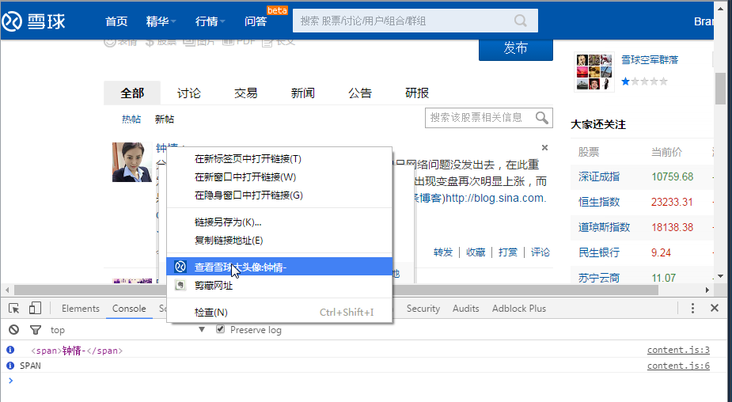
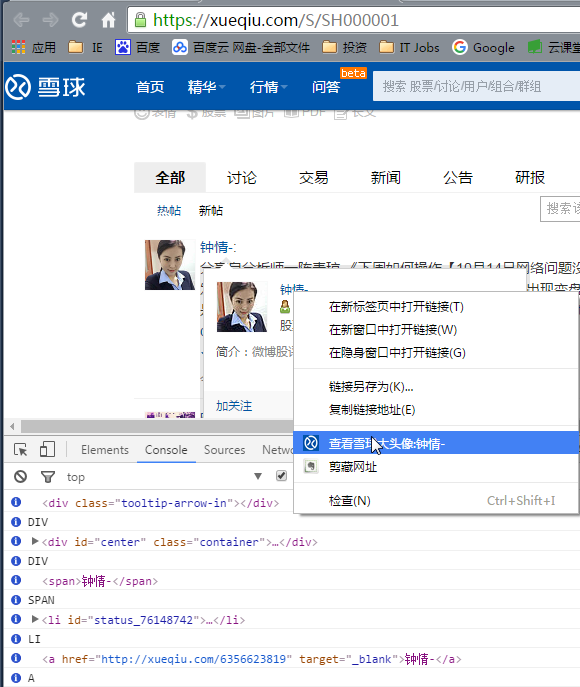

##雪球大头像助手
***

###1. 说明
去年接触到雪球网，财经投资类垂直网站中的佼佼者，我也一直通过雪球获取最新的投资信息。
年底时加入一个大V的投资群（现在由于收费问题被退出=.=!），期间群里的好友提出想看雪球的头像（女性），甚至发红包引诱。
出于好奇便用自己入门的网络和HTML知识研究了雪球网的用户链接，才有了这个chrome查看雪球大头像助手。后来发出下载链接，下载量迅速已破百，小小欣慰。

其实这款工具并没有什么高深的技术含量，但是“客户需求”和idea才是市场中产品最重要的催化剂。

`注：本工具只要求雪球网注入权限并只在雪球网出现右击菜单`

***
###2. 使用
加载chrome插件不必多说，请自行操作或度娘...

在任意雪球页面，在任意用户链接上右击，在出现的菜单中选中“查看雪球大头像:用户名”

即可在弹出的窗口中看到用户上传的原始头像。

兼容某些特殊的链接，如在鼠标浮于用户头像链接时会弹出雪球自己的用户profile窗口，右击此处用户名也可以实现查看功能。

***
###3. 末了
>本来想在工具中加入一个统计功能（使用一次便将雪球会员id发送到我VPS开放的接口），甚至做一个小网站聚合一下会员信息，展示他们的头像和投资战绩，但是在助手中加入向外请求的request未免让人浮想联翩。所以我专门建了网站提供查询功能，手动输入用户的id会被保留作统计，会有一个统计页面专门展示大家的“喜好”。